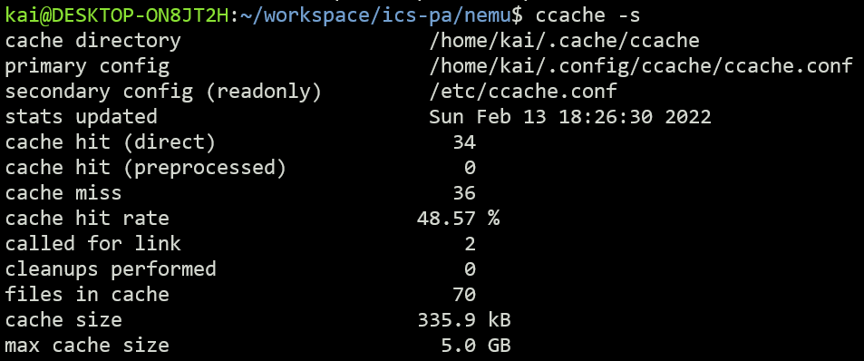
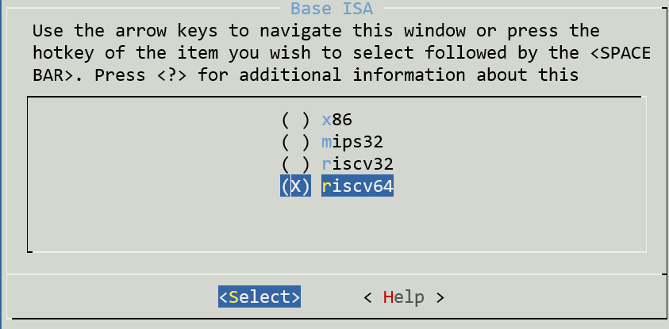
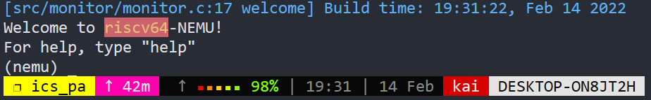

## PA1: 最简单的计算机

Date: 2022/2/11

#### 一. 基本配置

##### 1.1 配置高速缓存

* 安装`ccache`工具	`sudo apt-get install ccache`

* 配置`ccache`：参考`man`手册可知

  * 将`ccache`加入到系统环境变量	`export PATH=/usr/lib/ccache:$PATH`

  * 检测配置效果：

    


##### 1.2 选择ISA为`riscv-64`



##### 1.3 修改`make run`bug

* 注释掉`monitor.c`20、21行

* 运行结果正常

  


### 二. `RTFSC`

##### 2.1 添加GDB调试信息

* 在`make menuconfig`中添加调试信息选项

  

* 重新编译


#### 二. 实验问题

* 计算机可以没有寄存器吗?

  > 我觉得可以没有寄存器，`cpu`中`ALU`中单元可以直接从存储空间取数运算，运算完再存储在存储空间；其它特殊寄存器像`PC`也可以专门开辟空间存储值；只是这样速度会慢很多，效率很低。

* 一个程序从哪里开始执行呢?

  > `main`函数
  
* 阅读`init_monitor()`函数的代码, 你会发现里面全部都是函数调用. 按道理, 把相应的函数体在`init_monitor()`中展开也不影响代码的正确性. 相比之下, 在这里使用函数有什么好处呢?

  > 增加程序的可读性，便于后期的维护
  
* 宏是如何工作的吗?

  > 宏类似于一个变量，在预处理时将对应宏全部替换为对应值，有选取的编译某些代码
  
* 在`cmd_c()`函数中, 调用`cpu_exec()`的时候传入了参数`-1`, 你知道这是什么意思吗?

  > `cpu_exec()`中执行了`excute()`，而：
  >
  > ```c++
  > static void execute(uint64_t n) {
  >   Decode s;
  >   for (;n > 0; n --) {
  >    ...
  >   }
  > }
  > ```
  >
  > 由于`n`是无符号数，`-1`的补码会被理解为64位无符号数最大的一个

* 
